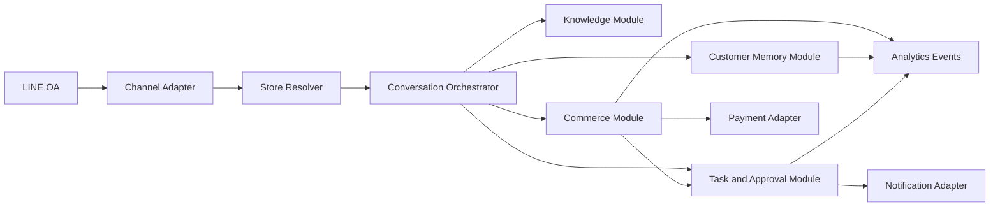

# Tawan Architecture

**Status:** Approved target architecture; implementation has not started

**Updated:** 2026-08-18

## 1. Architectural Shape

Tawan is one shared commerce product deployed as separate Tawan Instances. Each Store Workspace is a separately provisioned Duple with its own `duple_id`, schema, role, and channel identity, while the instances reuse a shared Tawan archetype implementation. This preserves the current one-Duple/one-schema convention without copying commerce logic per store.

The architectural invariant is:

> Every store-scoped operation resolves a trusted Store Context before data access, and every adapter receives only the credentials and schema permitted for that Store Workspace.

## 2. Existing Repository Boundaries

The currently available repository is a creator kit, not the complete runtime.

| Repository or system | Verified responsibility | Tawan responsibility |
|---|---|---|
| `duply-creator` | registration, per-Duple configuration, schema template, creator tools, documentation | Tawan registration, commerce schema/migrations, tool implementations, prompts, adapters owned at the Duple tier |
| `duply-agents` | referenced private runtime for chat, tool registry, memory, knowledge, reach, and LINE webhook | role-aware dispatch, shared commerce packs, media handling, idempotent command execution, Channel interfaces |
| `duply-astro` / Supabase project | referenced provisioning and database environment | migrations, roles, schema isolation, analytics extraction, backups, retention jobs |
| Dashboard application | target repository not yet verified | Store Owner and Store Staff web experience |
| LINE OA and Cloudflare | existing deployment path managed by the Duply team | first Channel Adapter and webhook route per Store Workspace |

No implementation plan may assign a file in a private repository until that repository is available and its actual interfaces have been read.

## 3. Module Map

### Store Resolver

**Interface:** Resolve a trusted Store Context from the authenticated channel destination or dashboard session.

**Owns:** Store Workspace identity, schema name, credential reference, active status, channel mapping, and support-access state.

**Does not own:** Customer identity, catalog, transactions, or business rules.

The resolver hides how Store Workspaces are provisioned and where credentials live. Callers cannot supply an arbitrary schema name.

### Channel Module

**Interface:** Normalize inbound channel events and deliver outbound messages or media with idempotency and delivery results.

**Adapters:** LINE OA first; future adapters only for officially supported channel capabilities.

The shared interface represents text, media references, sender identity, destination identity, reply token, external conversation identifier, timestamp, consent signals, and delivery outcome. Channel-specific payloads stay inside adapters.

### Conversation Orchestrator

**Interface:** Handle one normalized interaction within a Store Context and return a response plan plus validated commands.

The orchestrator applies the existing rule: **LLM proposes, Python decides, database writes**. The model may propose a catalog lookup, memory candidate, Sales Journey update, Task, Transaction, or Approval request. Deterministic modules validate and execute allowed commands.

The orchestrator never grants authorization from prompt text and never passes one Store Context into another store's adapter.

### Knowledge Module

**Interface:** Ingest store-approved sources, extract Knowledge Candidates, review conflicts, publish approved Store Knowledge, and retrieve facts with provenance.

The ingestion implementation may use OCR, document parsing, structured import, and an LLM. Those details remain behind the interface. Customer-facing retrieval returns only published knowledge and current operational facts.

### Customer Module

**Interface:** Resolve the store-specific Customer, read permitted context, propose or confirm Customer Memory, manage Customer Tiers, and process rights requests.

The module separates explicit facts from AI inferences and applies confidence, validity, retention, consent, and correction rules consistently.

### Commerce Module

**Interface:** Advance a Sales Journey, calculate an authorized offer, create or transition a Transaction, reserve capacity, and return an auditable result.

The module owns shared commercial invariants:

- price precedence;
- immutable line-item snapshots after confirmation;
- availability revalidation at commitment;
- reservation expiry;
- allowed status transitions;
- idempotency for writes;
- no negative stock or capacity;
- no unapproved exceptional price.

Business implementations sit behind this interface:

- retail and restaurant Orders;
- service Bookings;
- wholesale Quotations and Orders;
- construction Quotations and Projects;
- future Reservations and Rentals.

### Task And Approval Module

**Interface:** Create, assign, transition, escalate, resolve, and audit actionable work or controlled approvals.

The module hides notification routing and history maintenance. A caller requests a Task or Approval; the module decides deduplication, priority defaults, permitted assignees, timeout, and escalation.

### Campaign Module

**Interface:** Draft an audience, validate consent and commercial constraints, schedule an approved Campaign, deliver within contact policy, and attribute outcomes.

Campaign selection and personalization cannot change approved products, prices, dates, eligibility, budget, or frequency limits.

### Analytics Module

**Interface:** Accept normalized business events, produce store-scoped measures, and emit approved anonymous aggregates.

Operational aggregates refresh hourly and daily close produces stable store-local totals. Advanced models run daily or weekly and persist model version, evidence window, confidence, and explanation.

Advanced and cross-store intelligence is post-Phase-1 work. The Phase 1 Analytics Module implements only store-scoped operational events, hourly aggregates, daily close, and standard reporting.

Customer-level analytics never cross Store Workspaces. Anonymous benchmarking uses minimum cohort size, small-cell suppression, outlier handling, and documented re-identification testing.

### Audit Module

**Interface:** Record append-only security, authorization, approval, data-rights, support-access, and material commercial events.

The audit implementation protects integrity and applies a separate retention policy. Product modules do not invent their own incompatible audit formats.

## 4. Store Isolation

One Store Workspace maps to one Postgres schema and one least-privilege native role. Shared Tawan code uses a Store Context to select a preconfigured adapter; it does not interpolate an untrusted schema supplied by a Customer, model, request body, or URL.

Isolation is enforced at several layers:

1. Channel destination maps to one active Store Workspace.
2. Dashboard session includes authorized Store Workspace membership.
3. Runtime selects credentials scoped to one schema.
4. Database role cannot read another schema.
5. Cache, vector, object-storage, and queue keys include an internal Store Workspace identifier.
6. Logs and analytics exports remove or protect Customer identifiers.
7. Automated tests attempt cross-store reads and writes through every interface.

Platform Administrator support access uses a separate path with reason, duration, actor, target store, and complete audit history.

## 5. Runtime Flows

### Customer answer

1. Channel Adapter validates the webhook and normalizes the event.
2. Store Resolver derives Store Context from the destination.
3. Customer Module resolves the store-specific Customer.
4. Conversation Orchestrator retrieves published Store Knowledge and permitted Customer Memory.
5. The model proposes a reply and optional commands.
6. Deterministic modules validate commands.
7. Channel Adapter delivers the response and records the outcome.
8. Structured Interaction Events are saved; raw message retention follows policy.

### Unknown or conflicting fact

1. Retrieval returns no reliable fact or identifies a conflict.
2. Tawan tells the Customer it is checking rather than guessing.
3. Task Module creates or deduplicates an `answer_needed` or `knowledge_approval` Task.
4. Ingestion creates a Knowledge Candidate with provenance.
5. Authorized staff may review and recommend a decision.
6. The Store Owner approves permanent Store Knowledge.
7. Only approved knowledge becomes available to Customer answers.

### Transaction and payment

1. Commerce Module calculates price and validates availability.
2. Customer confirms the Transaction.
3. A reservation is created with configured expiry.
4. Payment Adapter generates a PromptPay QR.
5. Submitted media is stored by reference and creates a `payment_review` Task.
6. Staff with `payment_review` may inspect evidence and recommend a result; the Store Owner approves or rejects the payment in Phase 1.
7. Commerce Module performs the allowed Transaction transition exactly once.

### Campaign

1. Tawan drafts a Campaign and proposed audience.
2. Store Owner approves commercial and contact constraints.
3. Campaign Module removes Customers without valid permission or within cooldown.
4. Channel Adapter sends idempotently and records delivery.
5. Analytics Module attributes eligible downstream outcomes.

## 6. Failure Behaviour

- Missing, stale, conflicting, or low-confidence facts fail to a human Task.
- Safe reads may retry with bounded backoff.
- Writes require idempotency keys and return the prior result when repeated.
- Ambiguous payment or commercial actions do not retry blindly.
- Channel delivery failure does not roll back a committed Transaction; it creates a delivery result and follow-up Task.
- Analytics failure cannot block customer service or transaction processing.
- Ingestion failure leaves the source and run inspectable without publishing partial knowledge.

## 7. Scheduling

- Real time: inbound interactions, Tasks, approvals, availability, Transaction state, payment state, consent, and suppression.
- Hourly: dashboard aggregates and Campaign progress.
- Store-local daily close: final daily operational totals.
- Daily or weekly: advanced models and owner-selected knowledge review.
- Policy driven: reservation expiry, retention deletion, exports, backup expiry, and legal holds.

## 8. Deployment Constraints

The direct `main` push problem documented for the LFC repository does not apply here. This repository currently uses `origin/main`, but any future push or pull request must follow the repository owner's direction.

Live deployment requires the Duply team because the creator kit does not contain the full runtime, LINE media path, tool registry, database environment, or infrastructure configuration. Documentation and locally testable creator-kit work may proceed before live access; no blocked dependency may be represented as complete.

## Related Documents

- [Product specification](PRODUCT_SPEC.md)
- [Data model](DATA_MODEL.md)
- [Security](SECURITY.md)
- [Implementation plan](IMPLEMENTATION_PLAN.md)
