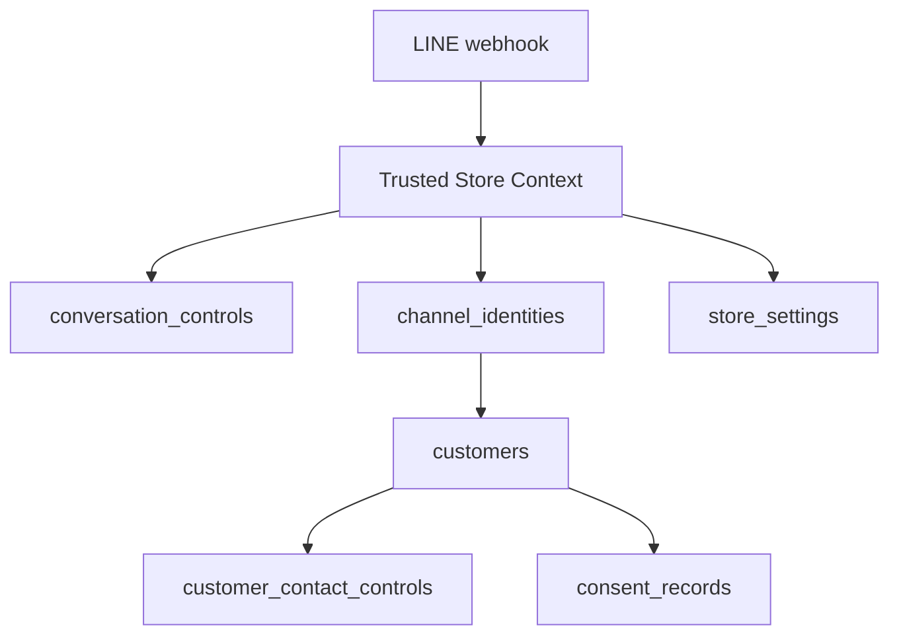
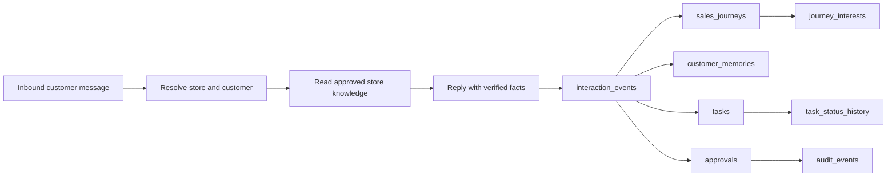
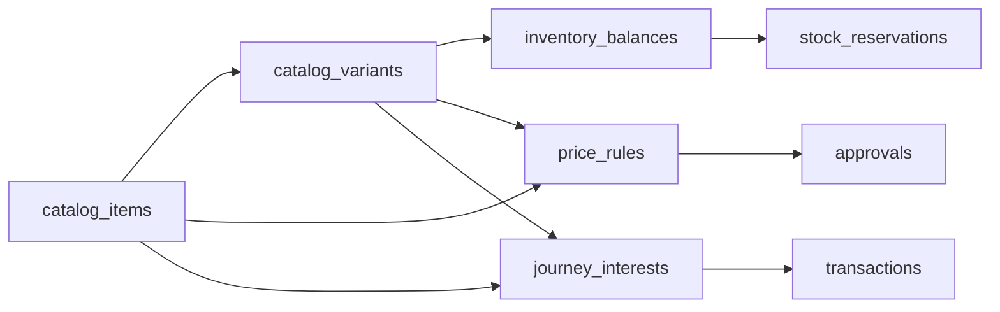
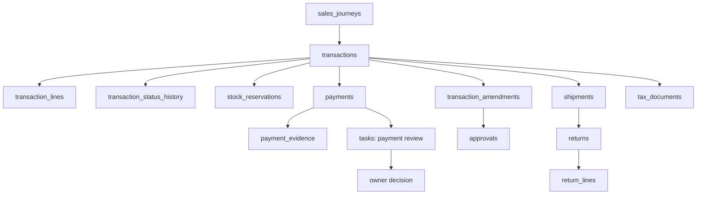
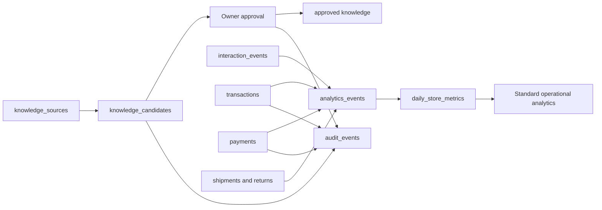

# Tawan Database Data Flow

**Updated:** 2026-09-03

**Live schema:** Supabase project `fpjevusrpausqunjhubk`, schema `tawan_ai`

This is the physical data-flow guide for additive migrations `0010`, `0020`,
and `0030`. It describes how a customer request becomes structured progress,
a transaction, fulfilment work, and analytics. Raw conversation text is not the
long-term system of record.

## 1. Store And Identity Boundary

Each Store Workspace owns one schema and its data. Shared Tawan software must
select the schema from trusted platform context before reading or writing.

`channel_identities` maps a store-local customer to a channel identity.
`customers` is never joined to another store by name, phone, email, or
similarity. Conversation controls determine whether Tawan may continue;
contact controls and consent determine whether outbound contact is allowed.

## 2. Reply-Time Capture Workflow

The reply orchestration step produces the customer response and structured
internal records for the same inbound event. There is no default separate
Noter step.

Every write should carry the inbound event correlation and an idempotency key.
Customer memories retain source, confidence, first/last seen, confirmation,
expiry, and correction metadata. Permanent knowledge changes require owner
approval.

## 3. Catalogue, Price, And Stock Flow

Variants hold stock-bearing differences such as size and colour. Inventory is
location-specific. Price rules use deterministic precedence and the winning
calculation is snapshotted on the transaction. A customer tier alone never
authorizes a discount.

## 4. Order And Payment Flow

The normal lifecycle is `draft`, `pending_confirmation`, `confirmed`,
`awaiting_payment`, `paid`, `in_progress`, and `completed`, with explicit
cancelled, expired, refunded, and disputed outcomes. Transaction lines are
commercial snapshots. Payment evidence may be received and reviewed, but
Phase 1 AI output cannot mark a payment as paid; the owner must approve it.

## 5. Knowledge, Audit, And Analytics Flow

The existing platform `knowledge_entries` table must be reconciled with the
runtime contract before it becomes the published Tawan knowledge source. The
new source and candidate tables provide provenance and owner review; they do
not silently overwrite existing platform knowledge. `analytics_events` is the
immutable event layer. `daily_store_metrics` is refreshed hourly and finalized
during daily close. Pro Campaign and advanced intelligence remain Pro-tier
work and require separate runtime implementation.

## 6. Operations And Governance

`job_runs` records hourly aggregates, daily close, retention, exports, and
reconciliation. `schema_migration_history` records applied schema versions.
`usage_ledger` records model/provider usage and cost references.
`store_entitlements` controls Standard, Pro, and Custom boundaries.
`store_branches`, `branch_hours`, and `branch_holidays` support branch-aware
availability. `tax_configs` and `processing_activities` support tax and privacy
governance.

## 7. Gaps Before Real Customer Data

- Add and test Row Level Security policies or an equally strong server-only access boundary.
- Connect the Duply runtime's trusted store resolver and transaction writer.
- Reconcile existing `user_memories`, `knowledge_entries`, and platform roles.
- Add disposable Postgres replay, rollback, backup, and restore evidence.
- Prove LINE media handling, duplicate-slip protection, and owner approval.
- Add retention, export, deletion, and Thai PDPA operational workflows.

## Related Documents

- [Data model](DATA_MODEL.md)
- [Security and privacy](SECURITY.md)
- [Testing](TESTING.md)
- [Current task status](CURRENT_TASK_STATUS.md)
