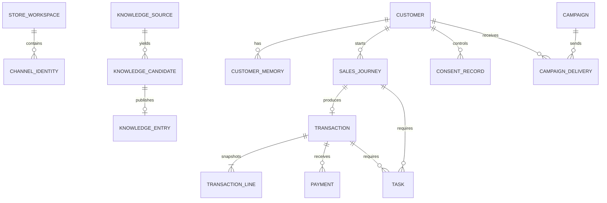

# Tawan Data Model

**Status:** Logical model approved for implementation planning

**Updated:** 2026-08-18

This document defines entities, relationships, invariants, and migration intent. It is not executable SQL. Physical design must be reconciled with the real Supabase and `duply-agents` runtime before migrations are written.

## 1. Tenancy Model

Each Store Workspace belongs to one separately provisioned Tawan Instance/Duple with a unique `duple_id`, one Postgres schema, and one schema-scoped role. Shared platform metadata maps the Tawan Instance and Store Workspace one-to-one to schema, active shared Tawan version, Channels, billing state, and credential references. Implementation must reuse shared commerce modules rather than copy a `duples/<store>/` codebase for every store.

Store tables do not rely on a caller-supplied `store_id` for security. Shared analytics exports add an internal Store Workspace identifier only after authorized extraction.

## 2. Existing Platform Tables

The current schema template contains:

- `agent_profiles`
- `user_profiles`
- `user_memories`
- `interact_log`
- `agent_call_log`
- `dream_log`
- `dream_observations`
- `knowledge_entries`
- reach tables
- finance-only tables

Tawan should extend these tables where their semantics fit and avoid parallel sources of truth. Before implementation, compare them with the private runtime because current creator documentation also refers to `knowledge_chunks`; that name and retrieval contract must be verified.

## 3. Identity And Access

### `store_settings`

One row per Store Workspace schema:

- display name and default Tawan branding;
- business type and enabled modules;
- timezone, currency, locale, closing time;
- reservation expiry;
- notification and review cadence;
- retention-policy references;
- configuration version.

### `channel_identities`

Maps a store-local person to a Channel identity:

- internal customer or staff identity;
- Channel;
- external customer identifier;
- external conversation identifier where applicable;
- verification state;
- first and last seen;
- unique constraint on Channel plus external identity inside the Store Workspace.

The LINE user ID is the primary Phase 1 external identity. Phone and email require verification before identity use. No record links Customers across stores by similarity.

### `user_profiles`

Continue using the existing table as the local person/profile root where compatible. Canonical Tawan roles are `store_owner`, `store_staff`, and `customer`; `platform_admin` remains a platform role outside ordinary store membership. Map or migrate existing platform labels explicitly rather than treating them as synonyms. Tawan-specific commercial detail should use dedicated related tables rather than an unlimited JSON object.

### `staff_capabilities`

- staff profile reference;
- capability;
- grantor;
- granted, effective, and revoked timestamps;
- reason.

Store Owner remains a role. Staff permissions are capabilities, not one all-powerful employee role.

## 4. Customer Memory And Consent

### `customer_memories`

If the existing `user_memories` table can carry the required metadata safely, migrate or extend it rather than duplicate it. Required logical fields are:

- Customer reference;
- category and normalized value;
- source type and source reference;
- explicit or inferred classification;
- confidence;
- first seen, last seen, confirmed, effective, and expiry times;
- confirmer and model/rule version;
- active, corrected, disputed, expired, or deleted status;
- sensitivity classification;
- superseded-memory reference.

Unconfirmed inference expires sooner than Customer-stated or staff-confirmed information. Sensitive traits are not valid segmentation fields.

### `customer_tiers`

- Customer;
- tier;
- rule or manual source;
- evidence snapshot;
- suggested, approved, effective, and expiry times;
- approver;
- override reason.

Tier is not a price authorization.

### `consent_records`

Append-only records of permission or objection:

- Customer;
- purpose;
- Channel;
- status;
- notice and wording version;
- source and actor;
- timestamp;
- evidence reference;
- withdrawal or objection reason where supplied.

The effective state is derived from the latest valid record. Direct-marketing objection creates immediate suppression.

### `data_subject_requests`

- verified requester and Customer;
- request type: access, portability, correction, objection, restriction, deletion;
- received and due times;
- scope and status;
- decision, legal exception, approver, and completion evidence;
- export or deletion job references.

## 5. Interaction And Sales Progress

### `interaction_events`

Structured business events such as:

- need expressed;
- Catalog Item viewed or discussed;
- preference stated or corrected;
- price requested;
- offer presented;
- consent changed;
- Sales Journey advanced;
- Transaction outcome.

Each event records Customer, Channel, external conversation reference, event type, structured payload, source, actor, occurred time, and retention class. It is not a full transcript.

### Raw conversation storage

The existing `interact_log` or a verified runtime message store may retain encrypted raw content for a short policy-driven period. Raw content needs purpose, expiry, access restrictions, and deletion coverage across cache, vector store, logs, exports, and backups. Long-term product behaviour must not depend on indefinite raw retention.

### `sales_journeys`

- Customer;
- business module;
- current common state and module state;
- summary and expressed need;
- estimated value and currency;
- first, last, and next-action times;
- assigned staff;
- source Channel;
- outcome and reason;
- optimistic concurrency version.

### `journey_interests`

Associates a Sales Journey with Catalog Items, variants, services, quantities, preferences, and interest strength without creating a Transaction prematurely.

## 6. Tasks And Approvals

### `tasks`

- type, status, priority;
- Customer, Sales Journey, and Transaction references where applicable;
- assignee and required capability;
- title and structured detail;
- due, escalation, created, updated, resolved, cancelled, and expiry times;
- deduplication key;
- resolution code and summary.

### `task_status_history`

Append-only status transition with actor, timestamp, reason, prior status, new status, and correlation identifier.

### `approvals`

- approval type;
- requested action and immutable proposed values;
- scope: Customer, Catalog Item, quantity, Transaction, Campaign, or Knowledge Candidate;
- requester and approver;
- requested, decided, effective, and expiry times;
- pending, approved, rejected, expired, or revoked status;
- reason and audit correlation.

No chat text alone represents an Approval.

## 7. Catalog, Availability, And Pricing

### `catalog_items`

The shared item sold or booked by a module:

- kind: product, menu item, service, material, or rental item;
- SKU or store-local code;
- name, description, category, images;
- active status;
- tax and fulfilment metadata;
- effective and updated times.

### `catalog_variants`

Relational variants for size, color, modifier group, package, duration, or other module-defined options. Phase 1 must not hide stock-bearing variants in an unvalidated JSON array.

### `inventory_balances`

- Catalog Item or variant;
- location;
- on-hand, reserved, and available quantity;
- low-stock threshold;
- version and updated time.

Stock mutation uses an atomic database operation. `available = on_hand - reserved` cannot become negative.

### `price_rules`

Represents standard, quantity, wholesale, tier, Campaign, or customer-specific prices with currency, conditions, effective time, expiry, authorizer, and priority category.

The pricing implementation enforces the approved precedence. The winning calculation and considered rules are snapshotted on the Transaction.

### `reservations`

Reserves stock, capacity, staff time, or another scarce resource for a Transaction. It records quantity, status, expiry, release reason, and idempotency key.

## 8. Transactions And Payments

### `transactions`

- type: order, booking, quotation, project, reservation, or rental;
- Customer and Sales Journey;
- common and module status;
- subtotal, discount, tax, shipping, and total;
- currency;
- price calculation snapshot;
- Channel and actor that created it;
- confirmation, expiry, completion, cancellation, and refund times;
- idempotency key and optimistic concurrency version.

The common lifecycle is:

`draft -> pending_confirmation -> confirmed -> awaiting_payment -> paid -> in_progress -> completed`

Allowed alternate outcomes are `cancelled`, `expired`, `refunded`, and `disputed`. Module states may add detail but must map to exactly one common state for reporting and authorization. Only the Commerce Module transitions state: Tawan or authorized staff may prepare `draft`; deterministic validation of complete items, price, availability, and required Customer details moves it to `pending_confirmation`; explicit Customer confirmation moves it to `confirmed`; payment initiation moves it to `awaiting_payment`; the Store Owner makes the final Phase 1 `paid` decision; authorized fulfilment staff may advance `in_progress` work; and refund/dispute transitions require separately authorized actions. Every transition is validated atomically and appended to history.

### `transaction_lines`

Immutable commercial snapshots after confirmation:

- Catalog Item and optional variant references;
- SKU/name/description snapshot;
- quantity and unit;
- list price, applied price, discount, tax, and line total;
- selected options;
- price-rule and Approval references.

Historical totals do not change when the live Catalog Item changes.

### `transaction_status_history`

Append-only allowed transitions with actor, reason, timestamps, and correlation identifier.

### `payments`

- Transaction;
- method and provider;
- requested and received amount;
- currency;
- external reference;
- pending, pending_review, paid, failed, refunded, or disputed status;
- submitted, reviewed, paid, and refunded times;
- reviewer and idempotency key.

### `payment_evidence`

- Payment;
- protected object reference rather than public image URL;
- exact media hash and normalized visual fingerprint;
- parsed bank transaction reference and transfer time where available;
- parsed fields and model version;
- confidence;
- review status and reviewer;
- retention class.

Phase 1 never transitions a Payment to `paid` solely from AI vision output.

Duplicate detection is Store Workspace-wide, not only Transaction-local. Reuse of the same exact hash, normalized fingerprint, or bank transaction reference across Payments creates a conflict that blocks owner payment approval. A probable fingerprint false positive requires a separate owner-only, reason-coded conflict-resolution action and audit before review can continue. The same confirmed bank transaction reference can never pay two Transactions and has no override path.

## 9. Module Extensions

### Retail and restaurant

`orders` stores fulfilment mode, address snapshot, preparation or dispatch times, and module status. Restaurant modifiers remain validated line options.

### Service booking

`bookings` stores service, staff/resource, start/end time, capacity, location, reschedule history, and attendance outcome.

### Wholesale

`quotations` and `quotation_versions` store scope, validity, quantity prices, approvals, acceptance, and conversion to an Order.

### Construction

- `projects`
- `project_milestones`
- `project_cost_items`
- `change_orders`
- `site_visits`

Construction records support quote win rate, backlog, estimated versus actual cost, gross margin, milestone progress, material variance, and overdue receivables.

Module tables reference the shared Transaction rather than duplicating Customer, payment, Task, consent, or audit models.

## 10. Knowledge Ingestion

### `knowledge_sources`

- type and original name or approved URL;
- protected storage reference;
- checksum;
- uploader;
- received time;
- sensitivity and retention classification.

### `ingestion_runs`

- source;
- parser, OCR, embedding, and model versions;
- status;
- started and completed times;
- extraction counts, warnings, errors, and cost-ledger reference.

### `knowledge_candidates`

- proposed category, key, and value;
- source location and excerpt reference;
- confidence;
- permanent, temporary, customer-specific, or unknown scope;
- effective and expiry times;
- conflict target and difference;
- needs_review, approved, rejected, expired, or published status;
- reviewer and decision.

### `knowledge_entries`

Use the existing published knowledge table if its runtime contract is confirmed. Each published entry needs provenance, version, effective/expiry dates, approval reference, and supersession history. Vector chunks are retrieval indexes, not the authoritative fact record.

## 11. Campaigns And Analytics

Campaign records and delivery processing are post-Phase-1 Pro capabilities. Standard operational analytics use `analytics_events` and `daily_store_metrics` without enabling outbound Campaign execution. Consent and objection records remain available to every plan for lawful customer communication and future upgrade continuity.

### `campaigns`

Stores the approved commercial envelope, audience rules, Channel, dates, frequency policy, status, approver, and attribution window.

### `campaign_deliveries`

One Customer delivery attempt with consent decision, suppression reason, personalized content reference, idempotency key, delivery result, and downstream attribution.

### `analytics_events`

Normalized immutable events compatible with familiar commerce concepts: view, interest, add, checkout, purchase, refund, promotion, and module-specific events. Each event has a schema version and store-local timestamp.

### `daily_store_metrics`

Store-local finalized measures by business date and metric version. Hourly projections remain distinguishable from daily close.

### `model_outputs`

Customer or store recommendation with model/rule version, evidence window, input categories, confidence, explanation, generated time, expiry, and human decision. Sensitive traits and unrestricted free text are excluded.

### Shared benchmark data

Only approved anonymous aggregates leave the Store Workspace. The export records aggregation version, cohort threshold, suppressed dimensions, review result, and provenance. Customer identifiers and free text never enter the benchmark schema.

## 12. Audit, Retention, And Export

### `audit_events`

Append-only events for authentication, authorization, support access, role/capability changes, knowledge publication, price and discount decisions, payment review, Campaign approval, rights handling, export, and deletion.

### `retention_policies`

Purpose, data class, trigger, period, disposition, legal-hold behaviour, approver, and policy version. Deletion jobs record affected systems and evidence.

Platform policy defines approved minimums, maximums, and defaults after counsel review. Store Owners choose only within those bounds. Statutory minimums and legal holds cannot be shortened; raw-message retention cannot exceed the platform maximum.

### `exports`

Tracks ordinary store exports, data-subject exports, paid migration work, status, scope, requester, generated files, expiry, and audit evidence. Existing store-controlled records are not misclassified as a paid BI product.

## 13. Cross-Cutting Invariants

- UUID primary keys for domain records; stable external IDs remain separate.
- `TIMESTAMPTZ` for instants and explicit Store Workspace timezone for business dates.
- `NUMERIC` plus ISO currency for money; never floating point.
- Non-negative quantities and amounts where the domain requires them.
- Append-only history for status, consent, approval, and material authorization changes.
- Unique idempotency keys for externally retried writes.
- Optimistic version or atomic procedure for contested stock and status transitions.
- No generic soft-delete policy. Apply purpose-specific deletion, anonymization, legal hold, or immutable accounting retention.
- Protected object references for sensitive media; no public payment-slip URLs.
- All model-generated data records provenance and model/rule version.
- All data movement into shared analytics is explicit, versioned, minimized, and audited.

## 14. Migration Sequence

1. Verify current private runtime schemas, table names, PostgREST profile, and memory/knowledge contracts.
2. Create migrations and rollback plans; do not mutate `schema_template.sql` as the only migration mechanism.
3. Add shared core tables and constraints to a disposable local Postgres database.
4. Add retail module and synthetic demo data.
5. Run isolation, transition, pricing, reservation, deletion, and export tests.
6. Provision a non-production Tawan Store Workspace.
7. Rehearse migration, rollback, backup, and restore.
8. Obtain explicit approval before any production schema change.

## Related Documents

- [Architecture](ARCHITECTURE.md)
- [Security and privacy](SECURITY.md)
- [Implementation plan](IMPLEMENTATION_PLAN.md)
